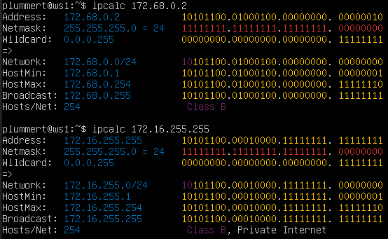
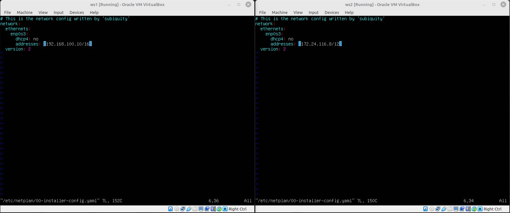

## Part 1. Инструмент ipcalc

### 1.1. Сети и маски

- адрес сети 192.167.38.54/13

**Адрес сети - 192.160.0.0** \

- перевод маски 255.255.255.0 в префиксную и двоичную запись, /15 в обычную и двоичную, 11111111.11111111.11111111.11110000 в обычную и префиксную \

- минимальный и максимальный хост в сети 12.167.38.4 при масках: /8, 11111111.11111111.00000000.00000000, 255.255.254.0 и /4 \
 \

### 1.2. localhost

- Определить и записать в отчёт, можно ли обратиться к приложению, работающему на localhost, со следующими IP: 194.34.23.100, 127.0.0.2, 127.1.0.1, 128.0.0.1

**Можно использовать на localhost - 127.0.0.2, 127.1.0.1** \
**Нельзя использовать на localhost - 194.34.23.100, 128.0.0.1** \
 \

### 1.3. Диапазоны и сегменты сетей

- какие из перечисленных IP можно использовать в качестве публичного, а какие только в качестве частных: 10.0.0.45, 134.43.0.2, 192.168.4.2, 172.20.250.4, 172.0.2.1, 192.172.0.1, 172.68.0.2, 172.16.255.255, 10.10.10.10, 192.169.168.1

**Публичные - 134.43.0.2, 172.0.2.1, 192.172.0.1, 172.68.0.2, 192.169.168.1** \
**Частные - 10.0.0.45, 192.168.4.2, 172.20.250.4, 172.16.255.255, 10.10.10.10** \
 \
 \
 \
 \

- какие из перечисленных IP адресов шлюза возможны у сети 10.10.0.0/18: 10.0.0.1, 10.10.0.2, 10.10.10.10, 10.10.100.1, 10.10.1.255

   
**Возможны - 10.10.0.2, 10.10.10.10, 10.10.1.255** \
**Не могут быть IP адресами шлюза - 10.0.0.1, 10.10.100.1** \
 

## Part 2. Статическая маршрутизация между двумя машинами

- С помощью команды `ip a` посмотреть существующие сетевые интерфейсы \

- Описать сетевой интерфейс, соответствующий внутренней сети, на обеих машинах и задать следующие адреса и маски: ws1 - 192.168.100.10, маска /16, ws2 - 172.24.116.8, маска /12 \

- Выполнить команду netplan apply для перезапуска сервиса сети \

### 2.1. Добавление статического маршрута вручную

- Добавить статический маршрут от одной машины до другой и обратно при помощи команды вида ip r add и пропинговать соединение между машинами \

### 2.2. Добавление статического маршрута с сохранением

- Перезапустить машины
> `sudo reboot`

- Добавить статический маршрут от одной машины до другой с помощью файла etc/netplan/00-installer-config.yaml \

- Пропинговать соединение между машинами \

## Part 3. Утилита iperf3

### 3.1. Скорость соединения

- 8 Mbps - 1 MB/s
- 100 MB/s - 800000 Kbps
- 1 Gbps - 1000 Mbps

### 3.2. Утилита iperf3

- Измерить скорость соединения между ws1 и ws2 \

## Part 4. Сетевой экран

### 4.1. Утилита iptables

>расширеная справка по настройке iptables для протоколов tcp и icmp командами `iptables -p tcp -h` и `iptables -p icmp -h` соответственно

- содержание файлов /etc/firewall для каждой машины \

- скрины с запуском файлов /etc/firewall.sh \

> если сначала пишутся запрещающие правила, то они не перезаписываются разрешающими.

### 4.2. Утилита nmap

- скрин с вызовом и выводом использованных команд ping и nmap \

## Part 5. Статическая маршрутизация сети

- Сеть \

### 5.1. Настройка адресов машин

- Настроить конфигурации машин в etc/netplan/00-installer-config.yaml согласно сети на рисунке. \

- Перезапустить сервис сети. Если ошибок нет, то командой ip -4 a проверить, что адрес машины задан верно. \

- пропинговать ws22 с ws21. Аналогично пропинговать r1 с ws11. \

### 5.2. Включение переадресации IP-адресов.

- включение переадресации IP (выполнение команды `sysctl -w net.ipv4.ip_forward=1` на роутерах):
> *При таком подходе переадресация не будет работать после перезагрузки системы.* \

- включение переадресации IP (изменение файла /etc/sysctl.conf с добавлением строки `net.ipv4.ip_forward = 1`)
> *При использовании этого подхода, IP-переадресация включена на постоянной основе.* \

### 5.3. Установка маршрута по-умолчанию

- Настроить маршрут по-умолчанию (шлюз) для рабочих станций. \

- Вызвать ip r и показать, что добавился маршрут в таблицу маршрутизации \

- Пропинговать с ws11 роутер r2 и показать на r2, что пинг доходит. 
> На r2 использовать команду `tcpdump -tn -i eth1`, eth1 заменить на сетевой интерфейс r2. \

### 5.4. Добавление статических маршрутов

- Добавить в роутеры r1 и r2 статические маршруты в файле конфигураций. \

- Вызвать ip r и показать таблицы с маршрутами на обоих роутерах. \

- Запустить команды на ws11 `ip r list 10.10.0.0/18` и `ip r list 0.0.0.0/0` \

> оба адреса попадают под маршрут по-умолчанию, однако для адреса 10.10.0.0/18 прописан статический маршрут. По этой причине маршруты указанных адресов различны.

### 5.5. Построение списка маршрутизаторов

- Запустить на r1 команду дампа `tcpdump -tnv -i eth0` и при помощи утилиты traceroute построить список маршрутизаторов на пути от ws11 до ws21. \

> Утилита Traceroute формирует UDP-датаграмму (сообщение, которое нужно доставить целевому серверу), упаковывает ее в IP-пакет и передаёт первому транзитному узлу. В заголовке такого IP-пакета есть поле TTL (Time To Live) — время жизни пакета. Оно определяет количество хопов, через которые пакет может пройти. На каждом узле TTL уменьшается на единицу. Если на пути к удаленному адресату время жизни пакета станет равно 0, маршрутизатор отбросит пакет и отправит источнику ICMP-сообщение об ошибке «Time Exceeded» (время истекло). \
> \
> Утилита Traceroute отправляет 3 UDP-пакета на определенный порт целевого хоста и ожидает ответа о недоступности этого порта. Первый пакет отправляется с TTL=1, второй с TTL=2 и так далее, пока запрос не попадет адресату.

### 5.6. Использование протокола ICMP при маршрутизации

- Запустить на r1 команду дампа `tcpdump -n -i eth0 icmp`, пропинговать с ws11 несуществующий IP (например, 10.30.0.111) с помощью команды `ping -c 1 10.30.0.111`. \

## Part 6. Динамическая настройка IP с помощью DHCP

- Для r2 настроить в файле /etc/dhcp/dhcpd.conf конфигурацию службы DHCP. Указать адрес маршрутизатора по-умолчанию, DNS-сервер и адрес внутренней сети. \

-  в файле resolv.conf прописать nameserver 8.8.8.8. \

- Перезагрузить службу DHCP командой systemctl restart isc-dhcp-server. \

- Настройка dhcp на ws21 \

- Перезагрузка ws21 \

- Через `ip a` показать, что ws21 получила адрес. Также пропинговать ws22 с ws21. \

- Указать MAC адрес у ws11, для этого в etc/netplan/00-installer-config.yaml надо добавить строки: macaddress: 10:10:10:10:10:BA, dhcp4: true \

- Для r1 настроить аналогично r2, но сделать выдачу адресов с жесткой привязкой к MAC-адресу (ws11). Провести аналогичные тесты \

- Запросить с ws21 обновление ip адреса \

> ИСПОЛЬЗУЕМЫЕ ОПЦИИ:
> маршрутизаторы — 10.100.0.11, 10.100.0.12 \
> серверы доменных имен — 10.10.0.1б 10.20.0.1

## Part 7. NAT

- В файле `/etc/apache2/ports.conf` на **ws22** и **r1** изменить строку `Listen 80` на `Listen 0.0.0.0:80`, то есть сделать сервер Apache2 общедоступным \

- Запустить веб-сервер Apache командой `service apache2 start` на **ws22** и **r1** \

- Добавить в фаервол, созданный по аналогии с фаерволом из Части 4, на r2 следующие правила:
> 1. удаление правил в таблице filter - `iptables -F`
> 2. удаление правил в таблице "NAT" - `iptables -F -t nat`
> 3. отбрасывать все маршрутизируемые пакеты - `iptables --policy FORWARD DROP` \

- Проверить соединение между **ws22** и **r1** командой ping \
***При запуске файла с этими правилами, ws22 не должна "пинговаться" с r1*** \

- Добавить в файл ещё одно правило: 
> 4. разрешить маршрутизацию всех пакетов протокола ICMP \

- Проверить соединение между **ws22** и **r1** командой ping \
***При запуске файла с этими правилами, ws22 должна "пинговаться" с r1*** \

- Добавить в файл ещё два правила: 
> 5. включить SNAT, а именно маскирование всех локальных ip из локальной сети, находящейся за r2 (по обозначениям из Части 5 - сеть 10.20.0.0) \
***Совет: стоит подумать о маршрутизации внутренних пакетов, а также внешних пакетов с установленным соединением***
> 6. включить DNAT на 8080 порт машины r2 и добавить к веб-серверу Apache, запущенному на ws22, доступ извне сети \
***Совет: стоит учесть, что при попытке подключения возникнет новое tcp-соединение, предназначенное ws22 и 80 порту*** \

- Проверить соединение по TCP для SNAT, для этого с ws22 подключиться к серверу Apache на r1 командой `telnet [адрес] [порт]` \
- Проверить соединение по TCP для DNAT, для этого с r1 подключиться к серверу Apache на ws22 командой telnet (обращаться по адресу r2 и порту 8080) \

## Part 8. Дополнительно. Знакомство с SSH Tunnels

- Запустить на r2 фаервол с правилами из Части 7 \
 \

- Запустить веб-сервер Apache на ws22 только на localhost (то есть в файле /etc/apache2/ports.conf изменить строку Listen 80 на Listen localhost:80) \
 \

### Установка и базовая настройка сервиса SSHD (сервера SSH) на ws22 (Local TCP forwarding) и ws11 (Remote TCP forwarding)

- 1. Устанавливаем командой `sudo apt-get install openssh-server`
- 2. Добавляем SSHD в автозагрузку командой `sudo systemctl enable sshd`
- 3. Проверка SSHD на ws22 \
 

### Воспользоваться Local TCP forwarding с ws21 до ws22, чтобы получить доступ к веб-серверу на ws22 с ws21 

 

- на ws21 запускаем команду `ssh -L 8080:localhost:80 10.20.0.5` \
 

- на ws21 нажимаем `Alt+F2` и замускаем новый терминал. 

- проверяем соединение c ws21 до ws22 командой `telnet 127.0.0.1 8080` \
 

### Воспользоваться Remote TCP forwarding c ws11 до ws22, чтобы получить доступ к веб-серверу на ws22 с ws11

> Например, «ws22» не имеет белого IP-адреса, находится за NAT или вообще все входящие соединения к нему закрыты. Нужно устанавливать ssh-соединение в обратном направлении — от «ws22» к «ws11». Т.е. «ws11» будет SSH-сервером и будет доступна по SSH с «ws22». 
 \

- выполняем подключение SSH-клиентом с «ws22» на «ws11» командой `ssh -R 8080:localhost:80 10.10.0.49` \
 

- проверяем соединение c ws11 до ws22 командой `telnet 127.0.0.1 8080` \
 

